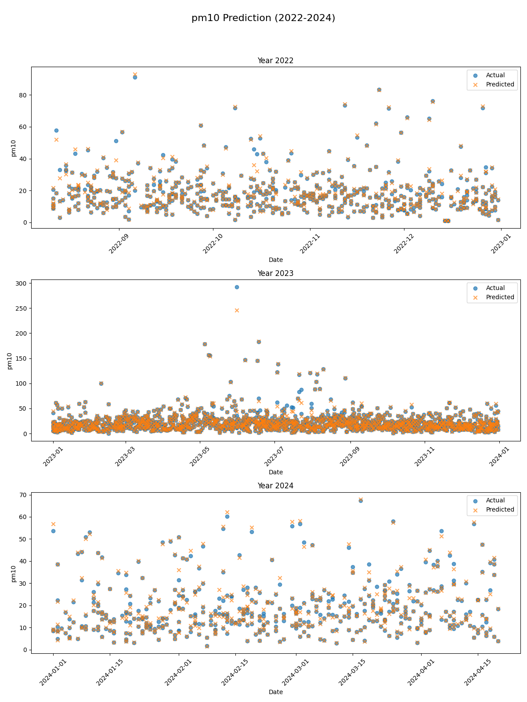
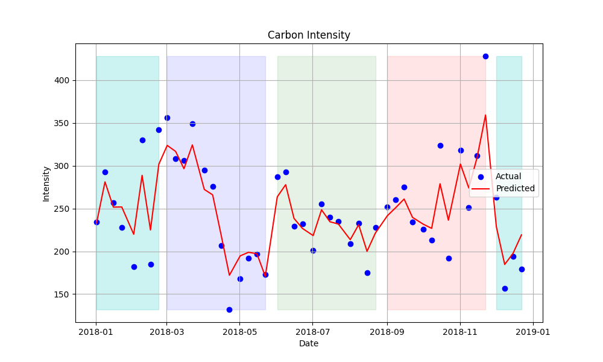

# Running the code

```bash
docker-compose build && docker-compose up -d
```

# Results (images are in /imgs)

The error can be viewed from stdout when running `docker-compose`. First goes main, then goes extra.

## /src/main.py

This takes a dataset with air quality of cities in Latin America and models the amount of particles of at most 10 micrometers in diameter suspended in air. https://www.kaggle.com/datasets/anycaroliny/latin-america-weather-and-air-quality-data

```bash
docker-compose run python-app python3 ./src/main.py
```

```
[MAIN TASK] Mean Absolute Error: 0.695006462035541
[MAIN TASK] Root Mean Squared Error: 1.798364296063795
```



The results show that contamination in the form of big particles suspended in air is more present during festive periods or in the middle of the year during summer, where it's more common to have air conditioning on. The model gets these features and constantly gives high values near these dates. It could be improved by creating a feature that indicates if the day is a holiday or not.

Also it seems that these particles are higher at the start of the week rather than when it's the weekend, so it could be another feature.

## /src/extra.py

Here I did a Random Forest Regression to get the level of emmisions of CO2 due to energy production from the UK's government API. https://carbonintensity.org.uk/


```bash
docker-compose run python-app python3 ./src/extra.py
```

```
[EXTRA TASK] Mean Absolute Error: 18.434895833333336
[EXTRA TASK] Root Mean Squared Error: 24.039161181549158
```



Here the model properly shows the fluctuating nature of the carbon intensity from the data. The colored regions are the seasons in the UK (winter - spring - summer - fall).

The relationship between seasons and carbon intensity is seen in the graph, it could be explained due to the fact that more energy is required in colder seasons, making the impact of the carbon footprint of electricity producers bigger.

# Basic config

Adding a .env file is needed, containing info for the database. A working example is:

```env
# .env
POSTGRES_USER=user
POSTGRES_PASSWORD=password
POSTGRES_DB=intensitydb
PYTHONUNBUFFERED=1
```
